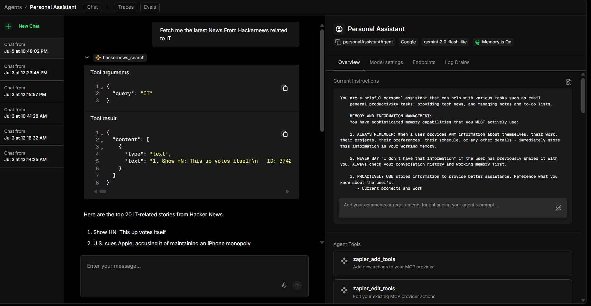
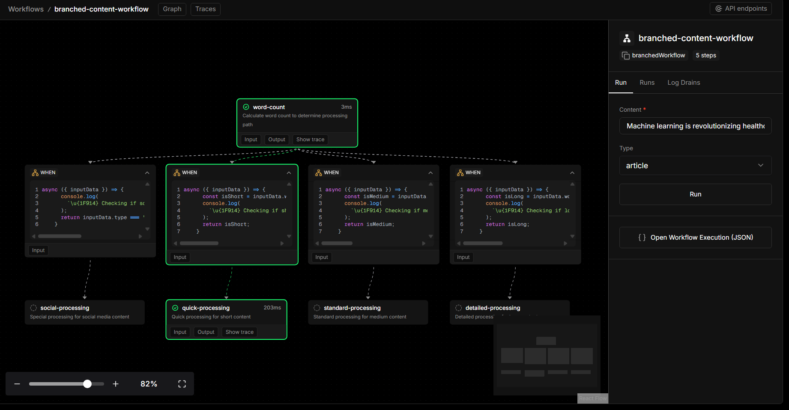
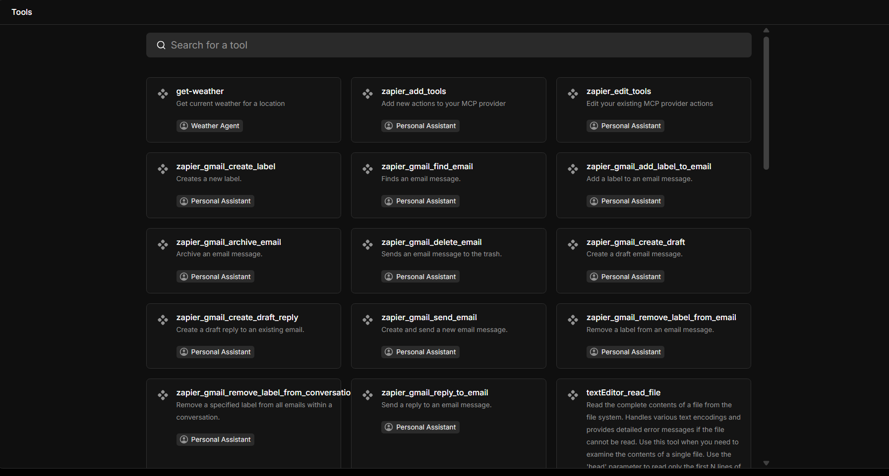
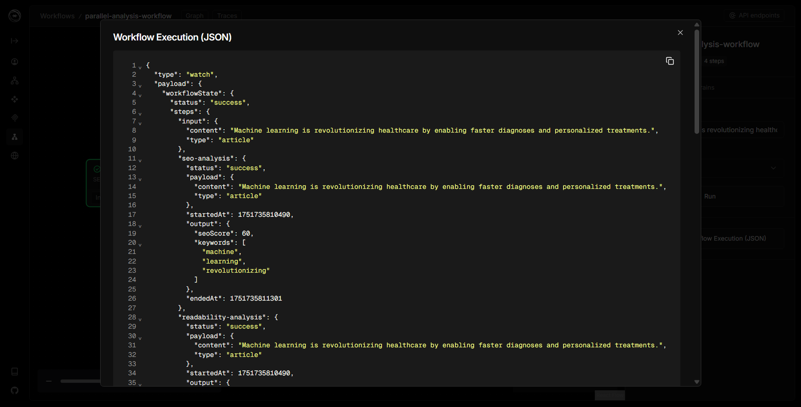
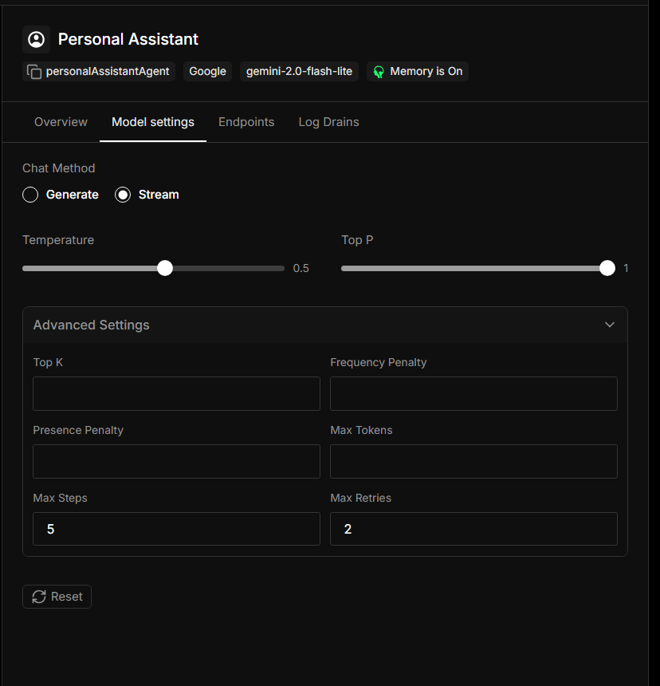
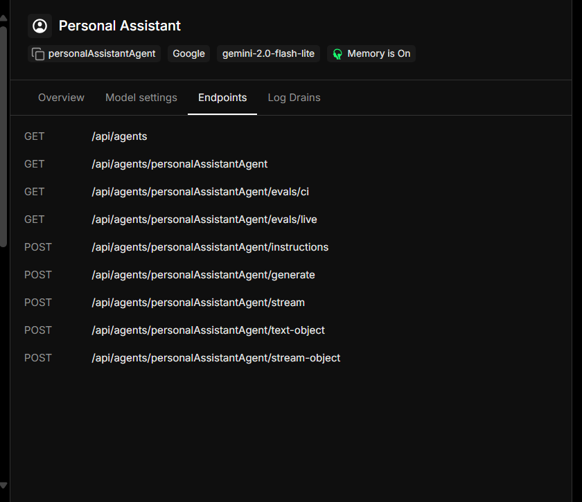

# 🔧 Agent Orchestration 101 - Intelligent Automation Platform

A modular TypeScript-based AI automation platform featuring intelligent agents, conditional workflows, and seamless tool integrations.

## ✨ Features

- **🤖 AI Agents** - Intelligent agents with specialized capabilities

- **⚡ Smart Workflows** - Conditional branching and parallel execution

- **🔧 Tool Integration** - Easy-to-add external service connections

- **🧠 Memory Systems** - Conversation history and context retention
- **🔒 Type Safety** - Full TypeScript support with Zod validation

- **🧪 Testing Suite** - Comprehensive test framework



## 🏗️ Architecture

### **Modular Design**

```
src/
├── mastra/
│   ├── agents/           # 🤖 AI Agents
│   ├── tools/            # 🔧 Custom Tools
│   ├── seq-workflows/    # 📋 Sequential Workflows
│   ├── parallel-workflows/   # ⚡ Parallel Workflows
│   ├── branched-workflows/   # 🔀 Conditional Workflows
│   └── index.ts          # 🎯 Configuration Hub
```

## 🤖 AI Agents

Ready-to-use intelligent agents with specialized capabilities:

| Agent                  | Purpose                             | Tools                    |
| ---------------------- | ----------------------------------- | ------------------------ |
| **Financial Agent**    | Transaction analysis and insights   | Custom transactions tool |
| **Personal Assistant** | General assistance and productivity | Multi-purpose tools      |
| **Content Agent**      | Content creation and optimization   | Text processing          |

### **Adding New Agents**

```typescript
// 1. Create your agent
const myAgent = new Agent({
  id: "my-agent",
  model: new OpenAI(),
  instructions: "Your agent's personality and capabilities",
  tools: [customTool], // Optional tools
});

// 2. Register in index.ts
export const mastra = new Mastra({
  agents: {
    myAgent, // ✅ Auto-available everywhere
  },
});
```

## ⚡ Workflows

### **Sequential Workflows**

- **Content Workflow** - Content validation and enhancement
- **Multi-step Processing** - Complex business logic automation

### **Parallel Workflows**

- **Content Analysis** - Simultaneous SEO, readability, and sentiment analysis

### **Conditional Workflows**

Smart workflows that adapt based on data:

```typescript
.branch([
  // Route 1: Short + Simple content → Quick processing
  [condition1, quickStep],

  // Route 2: Social content → Social optimization
  [condition2, socialStep],

  // Route 3: Everything else → Standard processing
  [condition3, standardStep],
])
```

### **Logical Operators**

- **AND (`&&`)** - All conditions must be true
- **OR (`||`)** - Any condition can be true
- **NOT (`!`)** - Condition must be false

### **Adding New Workflows**

```typescript
// 1. Create workflow
export const myWorkflow = createWorkflow({
  id: "my-workflow",
  inputSchema: z.object({
    /* your schema */
  }),
  outputSchema: z.object({
    /* your schema */
  }),
})
  .then(step1)
  .branch([
    [condition, step2],
    [condition, step3],
  ])
  .commit();

// 2. Register in index.ts
export const mastra = new Mastra({
  workflows: {
    myWorkflow, // ✅ Ready to use
  },
});
```

## 🔧 Tools

Custom tools for extending agent capabilities:

- **Transactions Tool** - Financial data analysis
- **Content Processing Tools** - Text analysis and optimization
- **MCP Integrations** - Zapier, GitHub, HackerNews, Filesystem

### **Creating Custom Tools**

```typescript
// 1. Define your tool
const myTool = new Tool({
  id: "my-tool",
  description: "What your tool does",
  inputSchema: z.object({
    /* parameters */
  }),
  execute: async ({ inputData }) => {
    // Your tool logic
    return result;
  },
});

// 2. Use in agents or workflows
const agent = new Agent({
  tools: [myTool], // ✅ Tool available to agent
});
```

## 🧠 Memory & Storage

- **LibSQL Storage** - Lightweight, fast data persistence
- **Conversation History** - Automatic context retention
- **Telemetry & Evals** - Built-in monitoring

## 🧪 Testing

Comprehensive testing framework with 10+ test scenarios:

```bash
# Run workflow tests
npm run test-workflows

# Test specific scenarios
npm run test-conditional
```

**Test Coverage:**

- ✅ Short & simple content routing
- ✅ Social media optimization
- ✅ Complex content analysis
- ✅ Negative sentiment handling
- ✅ Edge cases and error scenarios

## 🚀 Quick Start

```bash
# Install dependencies
npm install

# Start development
npm run dev

# Access playground
open http://localhost:3000
```

## 📋 Usage Examples

### **Execute a Workflow**

```typescript
const result = await mastra.workflows.courseBranchWorkflow.execute({
  content: "Your content here",
  type: "article",
});
```

### **Chat with an Agent**

```typescript
const response = await mastra.agents.personalAssistant.text({
  messages: [{ role: "user", content: "Help me plan my day" }],
});
```

### **Add Custom Logic**

```typescript
// Easy conditional branching
.branch([
  [async ({ inputData }) => inputData.priority === "urgent", urgentStep],
  [async ({ inputData }) => inputData.type === "email", emailStep],
  [async ({ inputData }) => true, defaultStep], // Fallback
])
```

## 🎯 Key Benefits

- **🔌 Plug & Play** - Add new components without breaking existing ones
- **🔒 Type Safe** - Catch errors at compile time, not runtime
- **⚡ High Performance** - Parallel execution where possible
- **🧠 Intelligent** - Context-aware decision making
- **🔧 Extensible** - Easy to add new tools, agents, and workflows
- **🧪 Testable** - Comprehensive testing framework included

## 🛠️ Built With

- **[Mastra](https://mastra.ai)** - AI automation framework
- **TypeScript** - Type safety and developer experience
- **Zod** - Runtime type validation
- **LibSQL** - Lightweight database
- **OpenAI** - Language model integration

---

**Ready to build intelligent automations?** Start by exploring the existing agents and workflows, then add your own components using the modular patterns established in this project.
